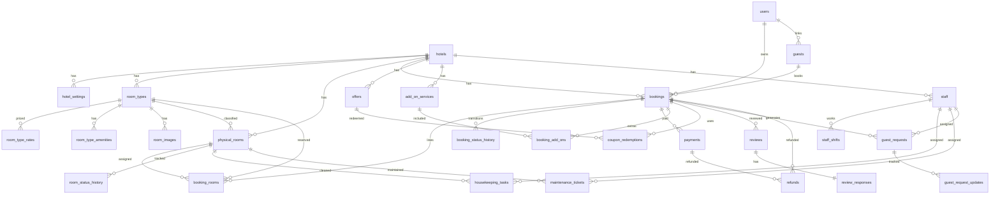

# ER Diagram

```mermaid
erDiagram
  hotels ||--o{ hotel_settings : has
  hotels ||--o{ room_types : has
  hotels ||--o{ physical_rooms : has
  hotels ||--o{ bookings : has
  hotels ||--o{ offers : has
  hotels ||--o{ add_on_services : has
  hotels ||--o{ staff : has

  users ||--o{ bookings : owns
  users ||--o{ guests : links

  guests ||--o{ bookings : books

  room_types ||--o{ room_type_rates : priced
  room_types ||--o{ room_type_amenities : has
  room_types ||--o{ room_images : has
  room_types ||--o{ physical_rooms : classified
  room_types ||--o{ booking_rooms : reserved

  physical_rooms ||--o{ booking_rooms : assigned
  physical_rooms ||--o{ room_status_history : tracked
  physical_rooms ||--o{ housekeeping_tasks : cleaned
  physical_rooms ||--o{ maintenance_tickets : maintained

  bookings ||--o{ booking_rooms : lines
  bookings ||--o{ booking_status_history : transitions
  bookings ||--o{ payments : paid
  bookings ||--o{ booking_add_ons : extras
  bookings ||--o{ coupon_redemptions : uses
  bookings ||--o{ reviews : reviewed
  bookings ||--o{ guest_requests : generates
  bookings ||--o{ refunds : refunded

  offers ||--o{ coupon_redemptions : redeemed

  add_on_services ||--o{ booking_add_ons : included

  payments ||--o{ refunds : refunded

  reviews ||--|| review_responses : has

  staff ||--o{ staff_shifts : works
  staff ||--o{ housekeeping_tasks : assigned
  staff ||--o{ maintenance_tickets : assigned
  staff ||--o{ guest_requests : assigned

  guest_requests ||--o{ guest_request_updates : tracked
```

This high-level diagram covers core entities, relationships, and cardinality for the hybrid inventory model (booking_rooms for allotment + physical_rooms for assignment).
